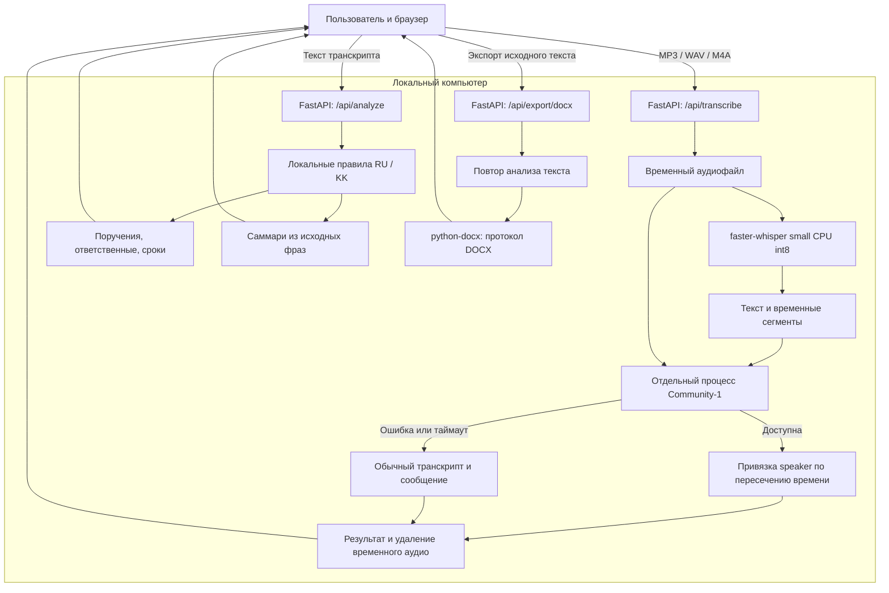

# 1. Название проекта

**Meeting AI** — система автоматического протоколирования совещаний. Хакатонный MVP команды OneByte для локальной обработки аудиозаписей.

# 2. Краткое описание

Ручное протоколирование занимает время: после встречи нужно восстановить содержание обсуждения, собрать поручения и проверить ответственных и сроки. Часть договорённостей может потеряться между записью, заметками и итоговым протоколом.

Meeting AI превращает запись в транскрипт, выделяет вероятные поручения, составляет краткое саммари и формирует документ для дальнейшей проверки человеком. Решение предназначено для секретарей совещаний, руководителей, кураторов и управленческих сотрудников.

Проект разработан по кейсу **Самрук-Казына**. Обработка аудио и содержания совещания выполняется на локальном компьютере.

# 3. Что реализовано

| Возможность | Состояние текущего MVP |
|---|---|
| Загрузка записи | Один файл **MP3, WAV или M4A** через выбор файла или перетаскивание. Пустые файлы и неподдерживаемые расширения отклоняются. |
| Локальная транскрибация | `faster-whisper`, модель `small`, `device="cpu"`, `compute_type="int8"`, фильтрация участков без речи. Возвращаются полный текст и временные сегменты. |
| Русский язык | Используется мультиязычная модель Whisper с автоматическим определением языка. Реальная локальная транскрибация проверялась; отдельные показатели точности не измерялись. Есть правила анализа русского текста. |
| Казахский язык | Доступен через мультиязычную модель; в анализаторе есть казахские шаблоны поручений и сроков. Проверены текстовые примеры. Качество распознавания казахских аудиозаписей отдельно не подтверждено. |
| Смешанная русско-казахская речь | Специальный режим переключения языка внутри записи не реализован. Анализатор обрабатывает русские и казахские фразы в одном тексте, но качество смешанной аудиоречи не подтверждено. |
| Поручения | Локальный анализ **по правилам**, без LLM: поиск формулировок действий и поручений. Вывод в существующую таблицу интерфейса. Возможны пропуски и ложные срабатывания. |
| Ответственные | Извлечение имён, отдельных названий подразделений и явных указаний из текста. Если определить ответственного не удалось, отображается **«Не определён»**. |
| Сроки | Поиск дат и поддерживаемых выражений на русском и казахском. Относительные сроки сохраняются как в записи, например «до пятницы» или «ертең». Неизвестный срок отмечается **«Не определён»**. |
| Статус поручений | Каждому найденному поручению присваивается **«В работе»**. Это начальное значение, а не отслеживание фактического исполнения. |
| Саммари | Отбор до четырёх значимых фраз исходного транскрипта по правилам. Это извлечение фрагментов текста, а не генеративное резюме локальной LLM. |
| Диаризация | Реализован отдельный процесс для `pyannote/speaker-diarization-community-1`, сопоставление временных интервалов и вывод `SPEAKER_00`, `SPEAKER_01` и далее. Работа зависит от доступности модели и нативных библиотек. |
| Fallback диаризации | При ошибке приложение возвращает обычную транскрибацию и сообщение **«Диаризация недоступна в текущей среде»**. На проверочном Windows-компьютере наблюдался `model_unavailable`: fallback проверен, успешная диаризация реальной моделью в этой среде не подтверждена. |
| Экспорт DOCX | Документ содержит название Meeting AI, дату формирования, саммари, таблицу поручений и полный транскрипт. |
| Экспорт PDF | **Не реализован.** Кнопка в интерфейсе отключена, endpoint экспорта PDF отсутствует. |
| Обработка ошибок | Сообщения о проблемах файла, модели, сервера и экспорта; состояние обработки; повтор анализа текста без повторного запуска Whisper. Временное аудио удаляется при штатном завершении обработки, включая обработанные ошибки. |

# 4. Как работает решение

1. Пользователь открывает локальный интерфейс и выбирает запись.
2. По нажатию **«Обработать запись»** браузер отправляет файл в FastAPI на том же компьютере. Интерфейс показывает состояние обработки.
3. Backend временно сохраняет файл и запускает faster-whisper. Получаются текст и временные границы сегментов.
4. Отдельный процесс пытается определить говорящих с помощью локальной Community-1. Каждому сегменту Whisper назначается speaker с максимальным суммарным временным пересечением. Если модуль недоступен, обработка продолжается без меток говорящих.
5. Backend удаляет временный файл и возвращает результат. Браузер показывает транскрипт и отдельно отправляет его текст на локальный анализ.
6. Анализатор выделяет вероятные поручения, ответственных и сроки, присваивает статус «В работе» и составляет саммари из фраз транскрипта.
7. Пользователь просматривает вкладки **«Саммари»**, **«Поручения»**, **«Транскрипт»** и проверяет результат.
8. Кнопка **«Экспорт DOCX»** отправляет исходный текст на локальный endpoint экспорта. Сервер повторяет тот же анализ и формирует протокол для скачивания.

При сбое анализа уже полученный транскрипт остаётся в интерфейсе. Кнопка **«Повторить анализ текста»** позволяет повторить этот этап без повторного распознавания аудио.

# 5. Технологии

| Компонент | Назначение |
|---|---|
| Python | Backend, анализ текста, управление процессом диаризации и экспорт. |
| FastAPI и Pydantic | HTTP-endpoint'ы, приём файлов и проверка JSON-запросов. |
| Uvicorn | Локальный ASGI-сервер. |
| HTML, CSS, JavaScript | Интерфейс, загрузка через `fetch`, вкладки результатов и скачивание DOCX. Сборка frontend и Node.js для запуска не нужны. |
| `python-multipart` | Приём аудио в multipart-запросах. |
| `faster-whisper` / CTranslate2 | Локальное распознавание речи моделью Whisper `small` в режиме CPU/int8. |
| PyAV | Декодирование аудио через faster-whisper; также подготовка waveform для диаризации. |
| `pyannote.audio` / PyTorch | Необязательная во время работы приложения локальная диаризация Community-1 на CPU. |
| `huggingface-hub` | Получение весов моделей при подготовке и доступ к локальному кэшу. |
| `re`, `collections` из стандартной библиотеки | Правила извлечения поручений, ответственных и сроков, отбор фраз для саммари. |
| `python-docx` | Создание протокола DOCX в памяти. |
| `unittest`, FastAPI TestClient и `httpx` | Автоматические проверки API, анализа, экспорта и fallback. |

Зависимости приложения перечислены в [requirements.txt](requirements.txt). **Внешние AI API OpenAI, Google, Anthropic и другие облачные сервисы обработки аудио не используются.** Модель Whisper выполняется локально; использование этой модели не означает обращение к OpenAI API.

# 6. Архитектура проекта

FastAPI одновременно отдаёт интерфейс и обслуживает его запросы. Whisper работает в процессе backend; модель загружается при первом распознавании и переиспользуется. Диаризация выполняется в отдельном процессе с ограничением времени, чтобы ошибка нативной библиотеки не завершила backend.



Основные файлы:

| Файл | Ответственность |
|---|---|
| [app.py](app.py) | Запуск приложения, загрузка аудио, Whisper и HTTP-endpoint'ы. |
| [diarization.py](diarization.py) | Изолированный worker Community-1, локальный кэш, сопоставление временных сегментов, fallback. |
| [meeting_analysis.py](meeting_analysis.py) | Анализ транскрипта по русским и казахским правилам. |
| [protocol_export.py](protocol_export.py) | Формирование DOCX. |
| [templates/index.html](templates/index.html) | Интерфейс, который отдаёт FastAPI. Корневой `index.html` — ранний статический макет, сервер его не использует. |
| [static/js/app.js](static/js/app.js), [static/css/styles.css](static/css/styles.css) | Поведение и оформление интерфейса. |
| [test_meeting_ai.py](test_meeting_ai.py), [test_speaker_diarization.py](test_speaker_diarization.py) | Автоматические тесты основного сценария и диаризации. |
| [DIARIZATION.md](DIARIZATION.md) | Подробная настройка модели и диагностика диаризации. |

Основные запросы:

| Метод и путь | Вход | Результат |
|---|---|---|
| `GET /` | — | Интерфейс приложения. |
| `POST /api/transcribe` | Multipart-поле `file` | `transcript`, `segments` с `id`, `start`, `end`, `text`, `speaker`, а также состояние `diarization`. |
| `POST /api/analyze` | JSON с полем `transcript` | `summary`, `tasks`, пояснение метода анализа. |
| `POST /api/export/docx` | JSON с полем `transcript` | Файл `meeting-ai-protocol.docx`. |

Чувствительные данные обрабатываются локально. База данных и серверная история совещаний не реализованы. Анализ и экспорт пока получают только текст: привязка поручений к speaker и включение speaker-разметки в DOCX не реализованы.

# 7. Установка и запуск

Команды выполняются в **Windows PowerShell**. Нужны Git и установленный **Python 3.12 x64** с Python Launcher (`py`). Интернет требуется для установки зависимостей и первоначального получения моделей; GPU не нужен.

## Шаг 1. Клонирование

```powershell
git clone https://github.com/BAITC-Hacks/hack-7da619ab-onebyte.git
cd hack-7da619ab-onebyte
```

## Шаг 2. Окружение и зависимости

```powershell
py -3.12 -m venv .venv
.\.venv\Scripts\python.exe -m pip install --upgrade pip
.\.venv\Scripts\python.exe -m pip install -r requirements.txt
```

Активация окружения не требуется: команды используют его Python напрямую. Менять политику выполнения PowerShell или отключать Windows Security не нужно. Pyannote и его зависимости устанавливаются из `requirements.txt`, но импортируются только в отдельном процессе диаризации.

## Шаг 3. Первоначальная загрузка Whisper

```powershell
.\.venv\Scripts\python.exe -c "from faster_whisper import WhisperModel; WhisperModel('small', device='cpu', compute_type='int8'); print('Whisper small готова')"
```

Команда получает модель `Systran/faster-whisper-small` и проверяет её загрузку. Аудиофайл не нужен, Hugging Face token для этой модели не требуется. Используйте тот же пользовательский аккаунт и окружение при запуске приложения: backend загружает Whisper с `local_files_only=True` и сам не скачивает недостающие веса.

## Шаг 4. Необязательная подготовка диаризации

Для основного сценария «транскрипт → анализ → DOCX» этот шаг можно пропустить.

Чтобы попробовать Community-1, примите условия доступа на [странице модели](https://huggingface.co/pyannote/speaker-diarization-community-1), создайте Hugging Face token с правом чтения модели и авторизуйтесь интерактивно:

```powershell
.\.venv\Scripts\hf.exe auth login
.\.venv\Scripts\python.exe diarization.py --download-model
```

Вводите токен только в приглашение авторизации; сохранять его как Git credential для запуска приложения не требуется. Не вставляйте токен в исходники или README. Загрузчик также может использовать переменную окружения `HF_TOKEN`, если она уже безопасно настроена.

После скачивания обработка использует только локальный кэш. При отсутствии доступа, весов или работоспособного pyannote остаётся обычная транскрибация. Для демонстрации без попытки запуска диаризации:

```powershell
$env:DIARIZATION_ENABLED = '0'
```

Для включения перед следующим запуском:

```powershell
$env:DIARIZATION_ENABLED = '1'
```

По умолчанию диаризация включена, лимит worker — 180 секунд. Настройки `DIARIZATION_TIMEOUT_SECONDS`, `DIARIZATION_MODEL_PATH` и `DIARIZATION_PYTHON` описаны в [DIARIZATION.md](DIARIZATION.md). Они позволяют задать лимит, каталог модели или Python отдельного окружения без изменения исходников.

## Шаг 5. Запуск FastAPI

```powershell
.\.venv\Scripts\python.exe app.py
```

Откройте **http://127.0.0.1:8000**. Приложение привязано к локальному адресу и запускается с автоматической перезагрузкой при изменении кода. Для остановки нажмите `Ctrl+C` в терминале.

Открывать HTML-файл двойным щелчком не нужно: интерфейс должен загружаться через FastAPI, чтобы работали запросы обработки и экспорта.

# 8. Как проверить решение

1. Выполните установку и подготовку Whisper, затем запустите приложение.
2. Откройте http://127.0.0.1:8000.
3. Запишите короткий демонстрационный фрагмент без конфиденциальных данных и сохраните его как MP3, WAV или M4A. Для проверки говорящих используйте запись с двумя людьми.
4. Загрузите файл и нажмите **«Обработать запись»**.
5. Дождитесь завершения. На CPU обработка может занять заметное время; первая загрузка модели добавляет задержку.
6. Откройте **«Транскрипт»** и сравните текст с записью. Если диаризация доступна, видны speaker-метки и временные границы. При недоступности должно появиться соответствующее сообщение, а текст должен сохраниться.
7. Проверьте **«Поручения»** и **«Саммари»**. Неизвестные поля должны быть отмечены явно. Саммари должно состоять из фраз записи.
8. Нажмите **«Экспорт DOCX»**, откройте скачанный файл в редакторе DOCX и проверьте название, дату формирования, саммари, таблицу поручений и полный текст.

Пример русских фраз:

> Обсудили запуск нового проекта. Алия, подготовь отчёт до пятницы. Нужно проверить смету.

При корректном распознавании правилу соответствуют поручение для Алии со сроком «до пятницы» и проверка сметы с неопределёнными ответственным и сроком.

Пример казахских фраз:

> Айгүл есепті ертең дайындасын. Бекзат құжаттарды жұмаға дейін жіберсін.

Эти формулировки проверены в текстовых тестах анализатора: ожидаются Айгүл / «ертең» и Бекзат / «жұмаға дейін». Их можно объединить с русским примером для проверки смешанной записи, но точное распознавание такой аудиозаписи заранее не гарантируется.

Автоматические проверки:

```powershell
.\.venv\Scripts\python.exe -m pip install httpx
.\.venv\Scripts\python.exe -m unittest test_meeting_ai test_speaker_diarization -v
```

В ходе разработки прошли 24 теста: анализ русского и казахского текста, API, содержимое DOCX, сопоставление временных интервалов, сбои диаризации и сохранность транскрипта. Модельные вызовы в этих тестах преимущественно заменены тестовыми объектами; они не являются оценкой качества речи или голосов. Отдельно проверялась цепочка на реальном коротком аудиофрагменте: Whisper → fallback диаризации → анализ → DOCX.

Запускайте указанные модули явно. `test_whisper.py` и `test_diarization.py` — ручные эксперименты с локальным файлом `Совещание №1.mp3`; этот файл не нужен для установки или автоматических тестов и не должен публиковаться вместе с проектом.

# 9. Данные и интеграции

Пользователь самостоятельно предоставляет аудиозапись. Для демонстрации используйте специально записанный пример. **Реальные записи должны быть анонимизированы до использования и передаваться только в разрешённой среде**; встроенного обезличивания в MVP нет.

Приложение отправляет файл из браузера только на локальный FastAPI. Временная копия аудио удаляется после завершения обработки, в том числе при обработанных исключениях. Текст отображается в браузере; сервер не сохраняет историю совещаний. DOCX формируется в памяти и сохраняется пользователем через скачивание.

При первоначальной подготовке загружаются:

- `Systran/faster-whisper-small` — веса распознавания речи;
- `pyannote/speaker-diarization-community-1` — необязательная модель разделения говорящих.

**Hugging Face нужен для получения весов моделей, а не для отправки аудиозаписей на обработку.** В приложении отсутствуют внешние AI API. Whisper использует локальные файлы; у worker диаризации включён offline-режим Hugging Face и отключена телеметрия. Установка пакетов и первоначальное скачивание весов требуют отдельного доступа к интернету; дальнейшая обработка рассчитана на локальный кэш.

Аудиозаписи, токены и конфиденциальные протоколы нельзя добавлять в репозиторий. `.gitignore` содержит правила для аудиофайлов, `.env`, окружений и каталогов результатов, но эти правила не заменяют проверку содержимого перед публикацией. Интеграции с платформами видеосвязи и корпоративными системами в MVP не реализованы.

# 10. Ограничения

- Анализ по правилам распознаёт ограниченный набор формулировок. Возможны ошибки в поручениях, именах и сроках; итоговый протокол требует проверки человеком.
- Саммари выбирает исходные фразы и может сокращать длинные предложения. Полноценная локальная LLM и семантическое выделение всех решений не подключены.
- Качество транскрипции зависит от шума, дикции, терминологии и наложения голосов. Казахская и смешанная аудиоречь не прошли отдельную оценку качества; показатели точности не заявляются.
- Диаризация зависит от локальных весов и совместимости pyannote/PyTorch с ОС. Smart App Control может блокировать нативные `.pyd`-библиотеки. Приложение использует fallback и не отключает защиту Windows.
- Worker диаризации загружает модель для каждой записи. В одном процессе приложения одновременно работает один worker; при занятости следующий запрос получает обычную транскрибацию. CPU-обработка длинных записей может превысить настроенный лимит.
- `SPEAKER_00` — условная метка голоса в пределах одной записи. Определение реального имени по голосу не реализовано. Одному сегменту Whisper назначается один доминирующий speaker, без пословного разделения нескольких голосов.
- Поручения пока не связаны с speaker. Человек, произнёсший поручение, не обязательно является его ответственным. В DOCX экспортируется текст без speaker-меток и временных границ.
- Относительные сроки не преобразуются в календарные даты. Статус «В работе» не обновляется автоматически; интерфейса редактирования поручений и контроля исполнения нет.
- PDF, интеграции с Teams/Zoom/Google Meet и СЭД отсутствуют.
- Нет учётных записей, разграничения доступа и постоянного хранения результатов. После перезагрузки страницы или выбора новой записи предыдущий результат не восстанавливается. Сервер предназначен для локальной демонстрации, а не для публичного многопользовательского доступа.
- Запросы анализа и DOCX ограничены одним миллионом символов транскрипта. Жёсткий лимит размера аудиозагрузки в приложении не задан, поэтому для демонстрации используйте короткие записи.

# 11. Deployed-версия

Публичная deployed-версия отсутствует. Решение разработано для локального запуска в соответствии с требованием обработки данных в закрытом контуре.
